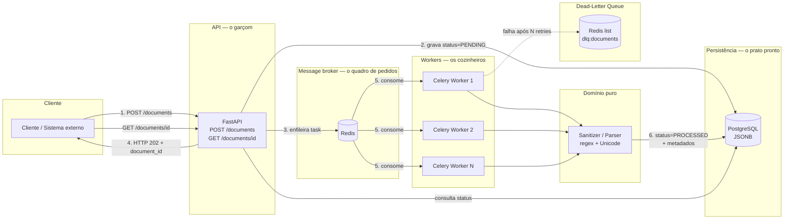
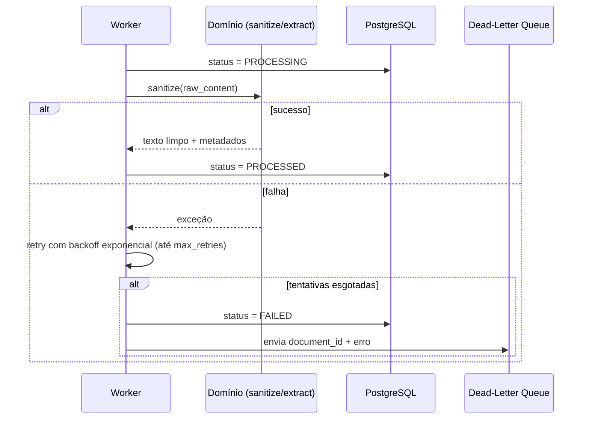

# DocPipeline — Pipeline Assíncrono de Ingestão e Processamento de Documentos

Pipeline distribuído e assíncrono para ingestão, sanitização e estruturação de
documentos textuais não estruturados em larga escala. Inspirado nos desafios reais
de empresas de tecnologia jurídica e processamento intensivo de dados (como a
**Jusbrasil**), o sistema desacopla a recepção de cargas pesadas de dados da etapa
de computação e persistência, garantindo alta disponibilidade, tolerância a falhas
e rastreabilidade total do ciclo de vida de cada documento.

## Índice

- [Visão conceitual: a cozinha de restaurante](#visão-conceitual-a-cozinha-de-restaurante)
- [Arquitetura](#arquitetura)
- [Antes vs. depois: por que o resultado é estratégico](#antes-vs-depois-por-que-o-resultado-é-estratégico)
- [Como rodar](#como-rodar)
- [Uso da API](#uso-da-api)
- [Testes](#testes)
- [Estrutura do projeto](#estrutura-do-projeto)
- [Conceitos de engenharia demonstrados](#conceitos-de-engenharia-demonstrados)
- [Roadmap](#roadmap)

## Visão conceitual: a cozinha de restaurante

Para entender a arquitetura sem se perder em jargão de sistemas distribuídos, pense
no pipeline como uma cozinha profissional de alta demanda:

1. **O Garçom** (API com FastAPI) recebe o pedido na porta de entrada, não cozinha
   na hora — para não travar o atendimento dos demais clientes — anota o pedido,
   entrega um comprovante (`document_id`) e responde imediatamente:
   *"Pedido recebido! Status: Aceito (HTTP 202)"*.
2. **O Quadro de Pedidos** (Redis, como message broker do Celery) organiza as
   comandas em fila por ordem de chegada e garante que nenhum pedido se perca em
   picos de movimento.
3. **Os Cozinheiros** (workers Celery em background) trabalham em paralelo nos
   fundos da cozinha, retiram as comandas da fila e executam o processamento
   pesado: higienização, extração de entidades e validação.
4. **O Prato Pronto** (PostgreSQL) é a persistência definitiva dos dados tratados,
   com atualização do status da comanda de `PENDING` para `PROCESSED` (ou
   `FAILED`), permitindo consulta a qualquer instante.

## Arquitetura



Fluxo de resiliência de uma task no worker:



## Antes vs. depois: por que o resultado é estratégico

O valor central deste pipeline está em transformar **texto bruto caótico e
inacessível para máquinas** em um **ativo de dados estruturado, sanitizado e
pronto para consumo**.

**Entrada** — originada de publicações, diários oficiais ou PDFs digitalizados via
OCR: carregada de ruído de formatação (cabeçalhos repetitivos, números de folha,
tags HTML quebradas, espaços duplos, erros de codificação Unicode). Imprópria para
consultas analíticas diretas e onerosa para modelos de linguagem.

**Saída** — texto limpo, contínuo e padronizado em UTF-8, com metadados jurídicos
extraídos de forma estruturada:

```json
{
  "document_id": "9b1deb4d-3b7d-4bad-9bdd-2b0d7b3dcb6d",
  "status": "PROCESSED",
  "metadata": {
    "numero_processo": "0001234-56.2026.8.13.0707",
    "tribunal": "TJMG",
    "comarca": "Varginha",
    "classe_judicial": "Execução Fiscal",
    "data_publicacao": "2026-09-22",
    "partes_identificadas": {
      "polo_ativo": "Fazenda Pública",
      "polo_passivo": "Empresa Comercial Ltda"
    },
    "palavras_chave": ["execução fiscal", "penhora", "intimação", "certidão da dívida ativa"]
  },
  "conteudo_limpo": "Vistos etc. Trata-se de execução fiscal proposta em face do devedor...",
  "processed_at": "2026-09-22T18:45:00Z"
}
```

Por que isso é estrategicamente relevante:

1. **Busca e filtragem de alta precisão** — colunas indexadas (`JSONB` no
   PostgreSQL) permitem filtrar instantaneamente por número de processo, data ou
   tribunal, sem varredura lenta em texto livre.
2. **Eficiência de custos em IA** — eliminar caracteres inúteis e rodapés
   repetitivos reduz drasticamente o consumo de tokens em prompts de LLMs,
   prevenindo alucinações causadas por ruído de digitalização.
3. **Prontidão para busca híbrida e vetorial** — o texto sanitizado alimenta
   perfeitamente motores lexicais (BM25/Elasticsearch) e modelos de embeddings
   para busca semântica em jurisprudência.

## Como rodar

Pré-requisitos: Docker e Docker Compose.

```bash
cp .env.example .env
docker compose up --build
```

Serviços disponíveis:

| Serviço | URL |
|---|---|
| API (docs interativa) | http://localhost:8000/docs |
| Flower (monitor do Celery) | http://localhost:5555 |
| PostgreSQL | localhost:5432 |
| Redis | localhost:6379 |

## Uso da API

**Enviar um documento para processamento:**

```bash
curl -X POST http://localhost:8000/api/v1/documents \
  -H "Content-Type: application/json" \
  -d '{
    "raw_content": "Processo nº 0001234-56.2026.8.13.0707. Comarca de Varginha. Classe Judicial: Execução Fiscal. EXEQUENTE: Fazenda Pública. EXECUTADO: Empresa Comercial Ltda. Trata-se de penhora e intimação para pagamento da certidão da dívida ativa.",
    "source": "DJE-TJMG"
  }'
```

Resposta (`202 Accepted`):

```json
{"document_id": "9b1deb4d-3b7d-4bad-9bdd-2b0d7b3dcb6d", "status": "PENDING", "message": "..."}
```

**Consultar o status:**

```bash
curl http://localhost:8000/api/v1/documents/9b1deb4d-3b7d-4bad-9bdd-2b0d7b3dcb6d
```

## Testes

```bash
pip install -e ".[dev]"

# Testes unitários (rápidos, sem dependências externas) — é o que roda no CI
pytest -m "not integration"

# Testes de integração (requerem Docker, via testcontainers)
pytest -m integration

# Lint e type-check
ruff check .
mypy app
```

## Estrutura do projeto

```
app/
├── main.py                 # entrypoint FastAPI
├── api/v1/documents.py     # "o garçom": endpoints POST/GET
├── core/                   # configuração e instância do Celery
├── domain/parser.py        # "o domínio puro": sanitização + extração (sem framework)
├── db/                     # modelos SQLAlchemy e sessão
├── schemas/document.py     # contratos Pydantic v2
└── workers/
    ├── tasks.py             # "os cozinheiros": task Celery com retry/backoff
    └── dlq.py                # Dead-Letter Queue
tests/
├── unit/                   # testes de domínio, 100% offline
└── integration/            # API + Postgres real via testcontainers
```

## Conceitos de engenharia demonstrados

- Sistemas distribuídos e padrão produtor-consumidor.
- Idempotência (chave de idempotência opcional na ingestão) e consistência
  transacional.
- Tolerância a falhas: retries com backoff exponencial e Dead-Letter Queue.
- Clean Architecture: `domain/parser.py` é puro — sem acoplamento a banco,
  fila ou framework — e 100% testável com testes unitários simples.
- Testes automatizados: unitários (pytest) e de integração (testcontainers).
- Containerização completa via Docker Compose (API, worker, Redis, Postgres,
  Flower).
- CI com lint (ruff), type-check (mypy) e testes automatizados (GitHub Actions).

## Roadmap

- Migrações versionadas com Alembic (hoje as tabelas são criadas via
  `metadata.create_all` no startup, por simplicidade).
- Indexação em Elasticsearch/OpenSearch e geração de embeddings para busca
  híbrida sobre `conteudo_limpo`.
- Ingestão de PDFs via OCR (ex.: Tesseract) como fonte adicional de entrada.
- Observabilidade: métricas do Celery/Prometheus e tracing distribuído.

---

Projeto de portfólio construído para demonstrar conceitos de sistemas
distribuídos aplicados a processamento de documentos jurídicos em escala —
domínio central da atuação da [Jusbrasil](https://jusbrasil.com.br).
